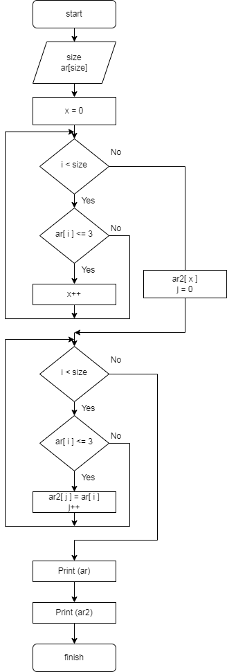

# **Итоговая контрольная работа**
***Описание задачи:***

Необходимо написать программу, которая из имеющегося массива строк формирует массив из строк, длина которых меньше либо равна 3 символам.

**Алгоритм решения задачи:**

1) С консоли вводим размер исходного массива строк. Исходя из введенного размера с помощью функции *CreateStrigArray* формируем исходный массив. (Я решила создать более универсальную программу, которая сможет выводить массив с длиной строк, размер которых задан с консоли.)

2) Просим ввести с консоли максимальную длину строк, которые будут отобраны во второй массив. Исходя из введеной длины с помощью функции *CreateShortArray* создаем новый массив, в который записываем строки заданной длины.

3) Печатаем исходный и результирующий массивы на экран.

**Блок-схема данного алгоритма:** 

